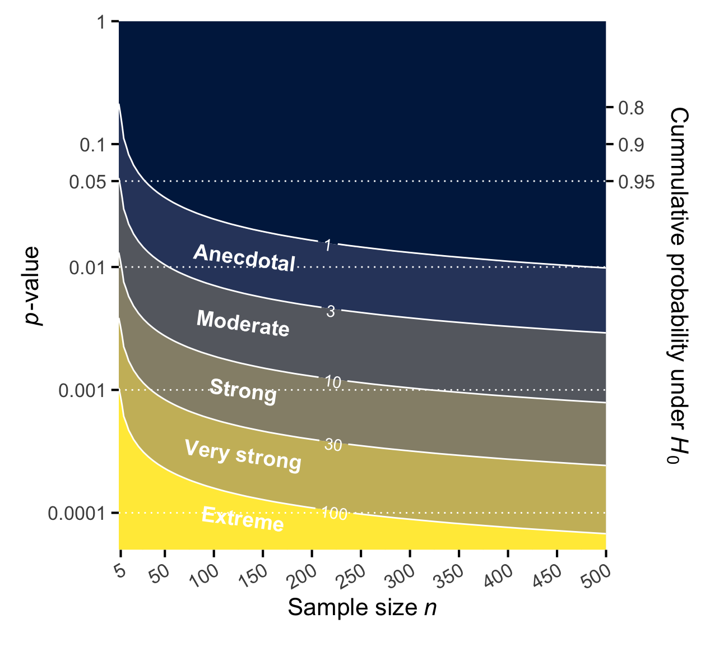

::: {.cell}

```{.r .cell-code}
load("./rouder-wetzel/rouder-wetzel.RData")
rouder_wetzel_p <- dat1
aczel_p <- read.csv("./aczel/data.csv", row.names = 1) |>
  dplyr::filter(is.na(t) != TRUE & is.na(N1) != TRUE)
```
:::

::: {.cell}

```{.r .cell-code}
p_boundaries <- c(0.0001, 0.001, 0.01, 0.05, 0.1, 1)
bf_labels <- c("100", "30", "10", "3", "1", "1/3", "1/10", "1/30", "1/100")
bf_breaks <- sapply(c(bf_labels), \(x) eval(parse(text = x)))
```
:::

::: {.cell}

```{.r .cell-code}
jab_p2 <- function (x, n, ratio = getOption("jab.ratio")) {
    assertthat::assert_that(is.numeric(x))
    assertthat::assert_that(is.numeric(n))
    p <- (x > 0 & x <= 0.1) * 3 * x + (x > 0.1 & x <= 0.5) * 
        4/3 * x^(2/3) + (x > 0.5 & x < 1) * x^(1/4)
    jab:::.ratio(p * n^(1/1.8), ratio)
}

minbf <- function(p) {
  ifelse(
    p < 1/exp(1)
    , -exp(1) * p * log(p)
    , 1
  )
}

chip_to_bicbf <- function(x, n, df = 1) {
  delta_ll <- -0.5 * qchisq(1 - x, df)
  exp(0.5 * df * log(n) + delta_ll) |>
    as.numeric()
}

to_reciprocal <- function(x) {
  ifelse(
    x >= 1
    , as.character(round(x))
    , paste0("1/", round(1/x))
  )
}

minp <- function(bf) {
  exp(lamW::lambertWm1(-bf / exp(1)))
}

# Functions to calculate Bayes factors for Chi-square tests taken from
# https://github.com/fdabl/Proportion-Puzzle/blob/master/Code/helpers.R

get_bfindep_anal <- function(y1, y2, n1, n2, a = 1, b = 1) {
  post0 <- lbeta(2 * a - 1, 2 * b - 1) - 2 * lbeta(a, b)
  post1 <- (
    lbeta(2 * a + y1 + y2 - 1, 2 * b + n1 - y1 + n2 - y2 - 1) -
    lbeta(a + y1, b + n1 - y1) - lbeta(a + y2, b + n2 - y2)
  )
  
  post0 - post1
}

get_ab <- function(
  y1, y2, n1, n2, sigma_psi = 1, sigma_beta = 1, samples = 10000
  ) {
  dat <- list(y1 = y1, y2 = y2, n1 = n1, n2 = n2)

  priors <- list(
    mu_psi = 0, sigma_psi = sigma_psi,
    mu_beta = 0, sigma_beta = sigma_beta
  )
  
  abtest::ab_test(dat, prior_par = priors, nsamples = samples)
}

# Logit Transformation Bayes factor
get_bfab <- function(y1, y2, n1, n2, sigma_psi = 1, sigma_beta = 1) {
  m <- get_ab(y1, y2, n1, n2, sigma_psi = sigma_psi, sigma_beta = sigma_beta)
  m$logbf$bf10
}
```
:::


[Wagenmakers, 2022](https://psyarxiv.com/egydq) showed that $p$-values of Wald test are directly related to Jeffrey's approximate Bayes factor, JAB (Jeffrey, 1936).

Jeffrey pointed out that an approximate Bayes factor can be obtained from the wald statistc $W$ as

$$
\text{JAB}_{01} = A \sqrt{n} \exp(-0.5 W),
$$

where $A = \frac{1}{\sqrt{2 \pi} \sigma g(\hat \theta)}$ is a constant that depends on the prior distribution $g()$ evaluated at the maximum likelihood estimate of the test-relevant parameter $\hat \theta$, and the Wald statistic $W = \bigg [ \frac{\hat \theta - \theta_0}{\text{se}(\hat \theta)} \bigg ]$.
For a normal unit-information prior $A = 1$ and Jeffrey (1961) suggested a general approximation $A = \sqrt{\pi / 2}$.

As noted by Wagenmakers (2022), the Wald statistic $W$ can be derived from the $p$-value through the quantile function $Q(p)$ of the $\chi^2$-distribution with 1 degree of freedom, 

$$
\text{JAB}_{01} = A \sqrt{n} \exp \big[-0.5 Q(p) \big].
$$

Based on these considerations, Wagenmakers (Eq., 9, 2022) suggested a simple set of rules as piecewise approximation to the relationship between $p$-values and JABs, the $3 p \sqrt{n}$ rule:

$$
\text{JAB}_{01} \approx

\begin{cases}
3 p \sqrt{n} & \text{if } & p \leq .10 \\
\sqrt{p} \sqrt{n} & \text{if } .10 < & p \leq .50 \text{ (simpler)} \\
\frac{4}{3} p^{2/3} \sqrt{n} & \text{if } .10 < & p \leq .50 \text{ (more precise)} \\
\sqrt{p}^{1/4} \sqrt{n} & \text{if } & p > .50 \\
\end{cases}
$$

The $3 p \sqrt{n}$ rule can be used to develop an intuition about the Bayesian evidence implied by a given $p$-value and sample size.
@fig-p-jab visualizes approximately how much evidence a $p$-value provides for the alternative (or null) hypothesis for a given sample size.
Note that both axes are on a log-scale.


::: {.cell}
::: {.cell-output-display}
{#fig-p-jab width=633.6}
:::
:::


The figure illustrates that for $p$-values below .10, relationship between $log(p)$ and $log(n)$ is approximately linear,

$$
\log(p) = \log(\text{JAB}_{01}/3) - 0.5 \log(n).
$$

That is, the JAB controls the intercept and the log of the sample size controls the slope.

Some have suggested to interpret $p$-values as continuous measures of evidence against the null hypothesis (p. 117, Bland, 2015; p. 157, Wasserman, 2004; also see Muff, Nilsen, O'Hara & Nater, 2021), @tbl-evidence-categories.


::: {#tbl-evidence-categories .cell tbl-cap='Categorical interpreations of $p$ values as evidence against $H_0$.'}

```{.r .cell-code}
tibble::tibble(
  p1 = c(NA, rev(p_boundaries[-c(1, length(p_boundaries))]))
  , p2 = dplyr::lead(p1)
  , maxbf1 = 1/minbf(p1)
  , maxbf2 = 1/minbf(p2)
) |>
  dplyr::mutate(
    p1 = papaja::apa_p(p1)
    , p2 = papaja::apa_p(p2)
    , maxbf1 = papaja::apa_num(maxbf1, na_string = "")
    , maxbf2 = papaja::apa_num(maxbf2, na_string = "")
  ) |>
  dplyr::mutate(
    p = paste0(
      ifelse(p1 != "", paste(p1, "< "), "\\phantom{.001 <}")
      , "$p$"
      , ifelse(p2 != "", paste(" $\\leq$", p2), "\\phantom{$\\leq$ .001}")
    )
    , maxbf = paste0(
      ifelse(maxbf1 != "", paste(maxbf1, "< "), "\\phantom{50.00 <}")
      , "$\\max{\\text{BF}_{10}}$"
      , ifelse(maxbf2 != "", paste(" $\\leq$", maxbf2), "\\phantom{$\\leq$ 50.00}")
    )
  ) |>
  dplyr::select(p, maxbf) |>
  dplyr::mutate(
    "Bland (2015)" = c("Little or no evidence", "Weak evidence", "Evidence", "Strong evidence", "Very strong evidence")
    , "Wasserman (2004)" = c("Little or no evidence", "Weak evidence", "Strong evidence", "Very strong evidence", "")
    , "Lee \\& Wagenmakers (2013)" = c("Little or no evidence", "Anecdotal evidence", "Moderate evidence", "(Very) strong Evidence", "Very strong or extreme evidence")
  ) |>
  dplyr::select(-maxbf, -dplyr::last_col(), maxbf, dplyr::last_col()) |>
  dplyr::rename("$p$" = p, "$\\max{\\text{BF}_{10}}$" = maxbf) |>
  knitr::kable()
```

::: {.cell-output-display}
|$p$                             |Bland (2015)          |Wasserman (2004)      |$\max{\text{BF}_{10}}$                               |Lee \& Wagenmakers (2013)       |
|:-------------------------------|:---------------------|:---------------------|:----------------------------------------------------|:-------------------------------|
|\phantom{.001 <}$p$ $\leq$ .100 |Little or no evidence |Little or no evidence |\phantom{50.00 <}$\max{\text{BF}_{10}}$ $\leq$ 1.60  |Little or no evidence           |
|.100 < $p$ $\leq$ .050          |Weak evidence         |Weak evidence         |1.60 < $\max{\text{BF}_{10}}$ $\leq$ 2.46            |Anecdotal evidence              |
|.050 < $p$ $\leq$ .010          |Evidence              |Strong evidence       |2.46 < $\max{\text{BF}_{10}}$ $\leq$ 7.99            |Moderate evidence               |
|.010 < $p$ $\leq$ .001          |Strong evidence       |Very strong evidence  |7.99 < $\max{\text{BF}_{10}}$ $\leq$ 53.26           |(Very) strong Evidence          |
|.001 < $p$\phantom{$\leq$ .001} |Very strong evidence  |                      |53.26 < $\max{\text{BF}_{10}}$\phantom{$\leq$ 50.00} |Very strong or extreme evidence |
:::
:::


@fig-p-jab and the rearranged $3 p \sqrt{n}$ rule show that this interpretation approximately corresponds to the formal quantification of Bayesian evidence for a sample size of $n = 1$, but quickly becomes optimistic as sample size increases.
This shows, that a principled interpretation of $p$-values as continuous measures of evidence must take the sample size into account (also see, Hartig & Barraquand, 2022).
Muff, Nilsen, O'Hara and Nater (2021) argue that this dependence on sample size is only relevant in small samples (Held & Ott, 2016).
As shown in @fig-p-jab-nonlog-n, the effect of sample size on the evidence in $p$ indeed levels off in larger samples, but at this point, the evidence categories have shifted such that what constitutes moderate evidence for the alternative hypothesis in small samples merely anecdotal evidence for in larger samples.


::: {.cell}
::: {.cell-output-display}
{#fig-p-jab-nonlog-n width=633.6}
:::
:::


These results, of course, depend on the choice of the prior distribution.
It is, however, possible to calculate the upper bound of the evidence for the alternative hypothesis (Bayarri et al. 2016),

<!-- TODO: What are the assumptions for this bound? -->

$$
\text{maxBF} = (-e~p~\log(p))^{-1},
$$

if $p < 1/e$ and $\text{maxBF} = 1$ otherwise.
As @tbl-evidence-categories shows, $.05 < p \leq .01$ provides moderate evidence at best.
We can solve this expression for $p$ to determine what $p$-values correspond to which evidence category in the ideal case,

$$
p = \exp(W(- \text{BF} / e)).
$$

where $W$ is the Lambert W function.
As @tbl-asymptotic-min-bf-categories shows, *in the best case* $.037 < p < .008$ provides moderate and $.008 < p < .002$ provides strong evidence in large samples.
This illustrates, that when Muff et al. (2021b) appeal to the large-sample stability the $p$-$\text{BF}$ association, they must assume very large samples and a prior distribution that maximizes the evidence.


::: {#tbl-asymptotic-min-bf-categories .cell tbl-cap='Evidence categories for $p$-values based on the maximum Bayes factor for the alternative hypothesis.'}

```{.r .cell-code}
tibble::tibble(
  minbf = bf_breaks[bf_breaks <= 1]
  , p = minp(minbf)
) |>
  dplyr::mutate(maxbf = 1/minbf) |>
  dplyr::select(maxbf, p) |>
  knitr::kable(
    digits = c(2, 3)
  )
```

::: {.cell-output-display}
| maxbf|     p|
|-----:|-----:|
|     1| 0.368|
|     3| 0.037|
|    10| 0.008|
|    30| 0.002|
|   100| 0.000|
:::
:::


Marsmaan & Wagenmakers (2017) note that with sample size $n$ fixed there is an approximately linear association between $p$-values and Bayes factor for point null hypotheses.
To illustrate this relationship, they plot one-sided $p$-values from $t$-test results collected by Wetzels et al. (2011) and the corrersponding Bayes factors from a reanalysis by Rouder et al. (2012), @fig-bf-jab.
Note that the across these $t$-test results, sample size $n$ is *not* fixed.
A much closer relationship is revealed, when differences in sample size are taken into account by applying the $3 p \sqrt{n}$ to the two-sided $p$-values.
We illustrate this in @fig-bf-jab.
The figure shows the close linear relationship between the JZS-BF and the $3 p \sqrt{n}$-JAB for the $t$-test results collected by Wetzels et al. (2011) and Azcel et al. (2018).
Note that the evidence against the null hypothesis is slightly overstated by the $3 p \sqrt{n}$-JAB relative to the JZS-BF.

When comparing two independent groups, the sample size $n$ used in the $3p \sqrt{n}$ rule is derived from the formula of the standard error based on the pool standard deviation and thus is $(n_1 \cdot n_2) / (n_1 + n_2)$.
For the a Welch's $t$-test, the ratio of variances is required to determine the effective samples size $n = (n_1 \cdot n_2) / (n_1 + wn_2)$, where $w = s^2_2/s^2_1$.


::: {.cell}

```{.r .cell-code}
rouder_wetzel_p_data <- as.data.frame(rouder_wetzel_p$one) |>
  dplyr::filter(N > 5) |>
  dplyr::rename(
    p = dplyr::starts_with("p")
    , bf10 = dplyr::starts_with("bf")
  ) |>
  dplyr::rowwise() |>
  dplyr::mutate(
    type = "One sample"
    , bf10 = exp(
      ttest.tstat(
        t = tvalue
        , n1 = N
        , nullInterval = NULL
        , rscale = 1
        , complement = FALSE
        , simple = FALSE
      )[['bf']]
    )
  ) |>
  dplyr::select(p, bf10, N, tvalue, type, effectsize) |>
  rbind(
    as.data.frame(rouder_wetzel_p$paired) |>
      dplyr::filter(N1 > 5) |>
      dplyr::rename(
        p = dplyr::starts_with("p")
        , bf10 = dplyr::starts_with("bf")
        , N = N1
      ) |>
      dplyr::rowwise() |>
      dplyr::mutate(
        type = "Paired samples"
        , bf10 = exp(
          ttest.tstat(
            t = tvalue
            , n1 = N
            , nullInterval = NULL
            , rscale = 1
            , complement = FALSE
            , simple = FALSE
          )[['bf']]
        )
      ) |>
      dplyr::select(p, bf10, N, tvalue, type, effectsize)
  ) |>
  rbind(
    as.data.frame(rouder_wetzel_p$two) |>
      dplyr::filter(N1 > 5 & N2 > 5) |>
      dplyr::rename(
        p = dplyr::starts_with("p")
        , bf10 = dplyr::starts_with("bf")
      ) |>
      dplyr::rowwise() |>
      dplyr::mutate(
        N = jab::ess_jab(N1, N2)
        , type = "Independent samples"
        , bf10 = exp(
          ttest.tstat(
            t = tvalue
            , n1 = N1
            , n2 = N2
            , nullInterval = NULL
            , rscale = 1
            , complement = FALSE
            , simple = FALSE
          )[['bf']]
        )
      ) |>
      dplyr::select(p, bf10, N, tvalue, type, effectsize)
  ) |>
  dplyr::ungroup() |>
  dplyr::mutate(
    bf01 = 1 / bf10
    , jabp = jab::jab_p(p, N)
    # , jab = jab:::.jab01(p = p, g = dcauchy(effectsize, scale = 1), se = (1/tvalue) * effectsize)
  ) |>
  dplyr::filter(p > .001 & p < .15)

aczel_p_data <- aczel_p |> 
  dplyr::rename(n1 = N1) |>
  dplyr::mutate(
    t = as.numeric(as.character(t))
    , p = as.numeric(as.character(p))
    , type = ifelse(
      is.na(N2) == TRUE
      , "One sample"
      , "Independent samples"
    )
    , n2 = ifelse(is.na(N2) == TRUE, 0, N2)
    , p.calculated = 2 * pt(
      abs(t)
      , ifelse(n2 == 0, n1 - 1, n1 + n2 -2)
      , lower = FALSE
    )
    , one.tailed = ifelse(0.01 + p.calculated / 2 < p, 0, 1)
    , p = p * (1 + 1 * one.tailed)
    , ess = ess_jab(n1, n2)
    , jabp = jab::jab_p(p, ess)
  ) |>
  dplyr::filter((n1 > 5 & n2 > 5) | (n2 == 0 & n1 > 5)) |>
  dplyr::rowwise() |>
  dplyr::mutate(
    bf10 = exp(
      ttest.tstat(
        t = t
        , n1 = n1
        , n2 = n2
        , nullInterval = NULL
        , rscale = 1
        , complement = FALSE
        , simple = FALSE
      )[['bf']]
    )
    , bf01 = 1 / bf10
  )

p_data <- rbind(
  dplyr::select(rouder_wetzel_p_data, p, bf01, jabp, type)
  , dplyr::select(aczel_p_data, p, bf01, jabp, type)
)
```
:::


::: {.cell}

```{.r .cell-code}
(p_data |>
  ggplot() +
    aes(y = bf01) +
    geom_point(aes(x = p/2, fill = "p"), color = "white", shape = 21, size = 3) +
    geom_point(aes(x = jabp, fill = "JAB"), color = "white", shape = 21, size = 3) +
    # geom_point(aes(x = log10(jab), fill = "JAB"), color = "white", shape = 21, size = 3) +
    geom_abline(slope = 1, intercept = 0, linetype = "22") +
    scale_fill_viridis_d(option = "F", begin = 0.3,
    end = 0.8, labels = c(bquote(3*italic(p)*sqrt(italic(n))*"-JAB"["01"]), bquote(italic(p)[1]))) +
    scale_x_continuous(
      trans = "log"
      , breaks = bf_breaks
      , labels = bf_labels
    ) +
    scale_y_continuous(
      trans = "log"
      , breaks = bf_breaks
      , labels = bf_labels
    ) +
    coord_fixed(ratio = 1) +
    labs(x = "Approximation", y = bquote("JZS-"*BF["01"])) +
    facet_wrap(~ type, ncol = 2) +
    guides(fill = guide_legend(title = "Approximation", reverse = TRUE)) +
    papaja::theme_apa(base_size = 16, box = TRUE) +
    theme(axis.text.x = element_text(angle = 45, hjust = 1))) |>
    lemon::reposition_legend("center", panel = "panel-2-2")
```

::: {.cell-output-display}
![Linear relationships between Bayes factors for point null hypotheses and $p$-value-based approximations for 63 and 428 $t$-test results collected by Aczel et al. (2018) and Wetzels et al. (2011; reanalyzed by Rouder et al., 2012), respectively. Orange points represent the logarithm of the one-sided $p$-values, the purple point represent the logarithm of $3 p \sqrt{n}$-JAB.To illustrate how taking the sample sizes $n$ for each $t$-test into account yields a much closer linear relationship, the faint purple points represent the logarithm of $3 p \sqrt{n}$-JAB shifted by a constant.](whats-in-a-p-value_files/figure-html/fig-bf-jab-1.png){#fig-bf-jab width=633.6}
:::
:::

::: {.cell}

```{.r .cell-code}
hoekstra <- read.csv("hoekstra/nejm.csv") |>
  dplyr::select(-P.value, -BF01) |>
  dplyr::rename(
    study = No.
    , y_1 = y1, y_2 = y2
    , n_1 = n1, n_2 = n2
  )

options(contrast = c("contr.sum", "contr.poly"))

hoekstra <- hoekstra |> 
  dplyr::rowwise() |>

  # 2 x 2-Chi-square test
  mutate(
    prop_test = prop.test(
    # prop_test = fisher.test(
      matrix(c(y_1, y_2, n_1 - y_1, n_2 - y_2), nrow = 2)
      , correct = TRUE
    ) |>
      broom::tidy() |>
      dplyr::mutate(estimate = estimate2 - estimate1)
  ) |>
  dplyr::ungroup() |>

  # Logisitic regression analysis
  dplyr::mutate(
    logit_glm = hoekstra |>
      dplyr::rowwise() |>
      dplyr::do(
        as.data.frame(.) |>
        dplyr::select(study, y_1, y_2, n_1, n_2) |>
        tidyr::pivot_longer(
          cols = c("y_1", "y_2", "n_1", "n_2")
          , names_to = c("var", "group")
          , values_to = "value"
          , names_sep = "_"
        ) |>
        tidyr::pivot_wider(
          values_from = value
          , names_from = var
        ) |>
        glm(cbind(y, n-y) ~ group, family = binomial, data = _) |>
        broom::tidy() |>
        tibble::as_tibble() |>
        dplyr::filter(term == "group2") |>
        dplyr::select(estimate, p.value)
      )
  ) |>
  dplyr::rowwise() |>
  dplyr::mutate(
    bf01_ib = -get_bfindep_anal( # Identical to original BF01-column
      y_1, y_2
      , n_1, n_2
      , a = 1, b = 1
    ) |> exp()
    # bf01_ct = BayesFactor::contingencyTableBF( # Identical to original BF01-column
    #   matrix(c(y1, n1-y1, y2, n2-y2), nrow = 2)
    #   , sampleType = "indepMulti"
    #   , fixedMargin = "cols"
    # ) |> as.vector()
    # , bf01_ct = 1/bf01_ct
    , bf01_lt = -get_bfab(
      y_1, y_2
      , n_1, n_2
      , sigma_psi = 1
    ) |> exp()
    # , jabp_prop = jab::jab_p(prop_test$p.value, n_1 + n_2)
    , jabp_prop = jab::jab_p(prop_test$p.value, 1/((1/(n_1+1) + 1/(n_2+1))))
    # , jabp_logit = jab::jab_p(logit_glm$p.value, n_1 + n_2)
    , jabp_logit = jab::jab_p(logit_glm$p.value, 1/(1/(y_1+0.5) + 1/(n_1 - y_1 + 0.5) + 1/(y_2+0.5) + 1/(n_2 - y_2 + 0.5)))
  )
```

::: {.cell-output .cell-output-stderr}
```
Warning: There was 1 warning in `mutate()`.
ℹ In argument: `prop_test = dplyr::mutate(...)`.
ℹ In row 25.
Caused by warning in `prop.test()`:
! Chi-Quadrat-Approximation kann inkorrekt sein
```
:::
:::


For the test of log odds ratio the standard error can be calculated from the p-value of the test statistic $z$,

$$
\text{SE}(\log{\text{OR}}) = -\frac{\log{\text{OR}}}{\Phi^{-1}(p/2)},
$$

where $\Phi^{-1}()$ is the quantile function of the standard normal distribution.
<!-- See https://stats.stackexchange.com/questions/532817/how-can-i-calculate-variance-of-log-odds-ratio-if-odds-ratio-extracted-from-thec -->
Alternatively, we can calculate it from the cell frequencies as,

$$
\text{SE}(\log{\text{OR}}) = -\sqrt{\frac{1}{y_1} + \frac{1}{y_2} + \frac{1}{n_1 - y_1} + \frac{1}{n_2 - y_2}},
$$

which implies that the effective sample size for the $3p\sqrt{n}$-rule is,

$$
n = \frac{y_1 y_2 (n_1 - y_1) (n_2 - y_2)}{n_1 (n_2 (y_1 + y_2) - y_2^2) - n_2 y_1^2}
$$

For the test in proportion-space, the effective sample size seems to be

$$
n = \frac{1}{((1/(n_1+1) + 1/(n_2+1)) * (y_1 + y_2 + 1)/(n_1 + n_2 + 2) * (1 - (y_1 + y_2 + 1)/(n_1 + n_2 
    + 1)) * \exp(2))},
$$

where this corresponds to the inverse of the standard error, but I have no idea, why need the extra factor of $\exp{2}$.
But if it's not there, the Bayes factor is too large.


::: {.cell}

```{.r .cell-code}
# ggplot(hoekstra) +
#   aes(x = prop_test$p.value/2, y = bf01_ib) +
#   geom_abline(slope = 1, intercept = 0, linetype = "22") +
#   geom_point() +
#     scale_x_continuous(trans = "log", breaks = seq(0, 1, 0.1)) +
#     scale_y_continuous(
#       trans = "log"
#       , breaks = bf_breaks
#       , labels = bf_labels
#     ) +
#     coord_fixed(ratio = 1) +
#     labs(x = bquote(p[1]), y = bquote(BF["01"])) +
#     papaja::theme_apa(base_size = 16, box = TRUE) +
#     theme(axis.text.x = element_text(angle = 45, hjust = 1))

ggplot(hoekstra) +
  aes(y = bf01_ib) +
  geom_abline(slope = 1, intercept = 0, linetype = "22") +
  geom_point(aes(x = jabp_prop, fill = "JAB"), color = "white", shape = 21, size = 3) +
  geom_point(aes(x = prop_test$p.value, fill = "p"), color = "white", shape = 21, size = 3) +
  geom_abline(slope = 1, intercept = 0, linetype = "22") +
  scale_fill_viridis_d(option = "F", begin = 0.3,
  end = 0.8, labels = c(bquote(3*italic(p)*sqrt(italic(n))*"-JAB"["01"]^(IB)), bquote(italic(p)[1]))) +
  scale_x_continuous(
    trans = "log"
    , breaks = bf_breaks
    , labels = bf_labels
  ) +
  scale_y_continuous(
    trans = "log"
    , breaks = bf_breaks
    , labels = bf_labels
  ) +
  coord_fixed(ratio = 1) +
  ggtitle(bquote(2%*%2*"-"*Chi^2*"-test")) +
  labs(x = "Approximation", y = bquote(BF["01"]^"(IB)")) +
  guides(fill = guide_legend(title = "Approximation", reverse = TRUE)) +
  papaja::theme_apa(base_size = 16, box = TRUE) +
  theme(axis.text.x = element_text(angle = 45, hjust = 1))

ggplot(hoekstra) +
  aes(y = bf01_lt) +
  geom_abline(slope = 1, intercept = 0, linetype = "22") +
  geom_point(aes(x = jabp_logit, fill = "JAB"), color = "white", shape = 21, size = 3) +
  geom_point(aes(x = prop_test$p.value, fill = "p"), color = "white", shape = 21, size = 3) +
  geom_abline(slope = 1, intercept = 0, linetype = "22") +
  scale_fill_viridis_d(option = "F", begin = 0.3,
  end = 0.8, labels = c(bquote(3*italic(p)*sqrt(italic(n))*"-JAB"["01"]^(LT)), bquote(italic(p)[1]))) +
  scale_x_continuous(
    trans = "log"
    , breaks = bf_breaks
    , labels = bf_labels
  ) +
  scale_y_continuous(
    trans = "log"
    , breaks = bf_breaks
    , labels = bf_labels
  ) +
  # coord_fixed(ratio = 1) +
  ggtitle("Contrast-coded logistic regression") +
  labs(x = "Approximation", y = bquote(BF["01"]^"(LT)")) +
  guides(fill = guide_legend(title = "Approximation", reverse = TRUE)) +
  papaja::theme_apa(base_size = 16, box = TRUE) +
  theme(axis.text.x = element_text(angle = 45, hjust = 1))
```

::: {.cell-output-display}
![Linear relationships between Bayes factors for point null hypotheses and $p$-value-based approximations for 39 results of tests comparing two proportions collected by Hoekstra et al. (2018) et al. (2011; reanalyzed by Dablander et al., 2021). Orange points represent the logarithm of the one-sided $p$-values, the purple point represent the logarithm of $3 p \sqrt{n}$-JAB. To illustrate how taking the sample sizes $n$ for each $t$-test into account yields a much closer linear relationship, the faint purple points represent the logarithm of $3 p \sqrt{n}$-JAB shifted by a constant.](whats-in-a-p-value_files/figure-html/fig-hoekstra-ps-1.png){#fig-hoekstra-ps-1 width=672}
:::

::: {.cell-output-display}
![Linear relationships between Bayes factors for point null hypotheses and $p$-value-based approximations for 39 results of tests comparing two proportions collected by Hoekstra et al. (2018) et al. (2011; reanalyzed by Dablander et al., 2021). Orange points represent the logarithm of the one-sided $p$-values, the purple point represent the logarithm of $3 p \sqrt{n}$-JAB. To illustrate how taking the sample sizes $n$ for each $t$-test into account yields a much closer linear relationship, the faint purple points represent the logarithm of $3 p \sqrt{n}$-JAB shifted by a constant.](whats-in-a-p-value_files/figure-html/fig-hoekstra-ps-2.png){#fig-hoekstra-ps-2 width=672}
:::
:::
